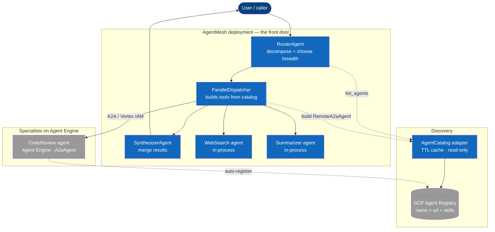
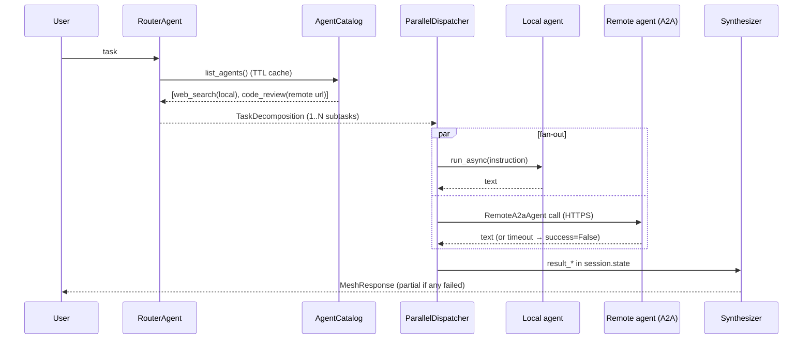

# ✨ Remote Specialists over A2A with GCP Agent Registry Discovery

## Enhancement Summary

**Deepened on:** 2026-06-23
**Sections enhanced:** Verified Grounding, Key Decisions, Technical Approach (catalog / dispatcher / server / Dockerfile + new Deploy & Auth), Phases, Risks, Acceptance Criteria, Open Questions, Sources
**Research inputs:** ADK 2.2.0 A2A source audit · GCP Agent Registry 5-angle API research · Cloud Run service-to-service auth · security-sentinel · architecture-strategist · agent-native-reviewer · code-simplicity-reviewer · kieran-python-reviewer

### Key Improvements
1. **Exact ADK 2.2.0 signatures verified from installed source.** `to_a2a()` returns a Starlette ASGI app (no bundled uvicorn; default port **8000**, override per port policy), and `RemoteA2aAgent` fetches its card **lazily on first call** (a down server raises `AgentCardResolutionError` at call time, not construction). Auth injects via `a2a_client_factory`. A primary `LlmAgent` skill `id` defaults to the **agent `name`**, so the pilot must be named `code_review` *or* ship a hand-built `AgentCard` with `AgentSkill(id="code_review", ...)`.
2. **GCP Agent Registry reached GA on 2026-06-18** (was Public Preview — this weakens, though does not eliminate, the "Preview churn" rationale for the adapter). On Agent Engine, agents **auto-register** on `agent_engines.create()` — no manual `services.create`; `agents/*` is a read-only auto-generated resource the adapter only **lists**. The manual `services.create` write path (`agentSpec.type="NO_SPEC"` storing just `{displayName, interfaces[].url}` — exactly the brainstorm's `{name, a2a_url}` intent) is reserved for registering agents hosted **outside** Google Cloud. **No Python GA client library**; use `google-api-python-client` discovery (`build("agentregistry","v1alpha")`) or raw REST + `google-auth`.
3. **Agent Engine deploy & auth recipe** (✅ hosting decided 2026-06-23; supersedes the original Cloud Run recipe). Deploy via `client.agent_engines.create()` with an `A2aAgent` wrapper (no `to_a2a()`, no Dockerfile, no `$PORT`/uvicorn); auth is Vertex IAM (`roles/aiplatform.user` or per-agent SPIFFE Agent Identity) + a single `cloud-platform` Bearer — no per-target ID token, no `roles/run.invoker`. Agents **auto-register** in Agent Registry on create. See the "Deploy & Auth (Vertex AI Agent Engine)" section.
4. **Must-fix-before-coding architecture gaps.** The dispatcher's construction-time `sub_agents` `model_validator` is incompatible with a dynamic catalog; per-request `RemoteA2aAgent` construction would rebuild httpx clients on every call (no pooling); `result_{name}` should key on the **capability string** (what the router is told to echo verbatim), not the router-supplied agent name.

### New Considerations Discovered
- **SSRF via card URL (security C2) — largely structural on Agent Engine:** targets are fixed `*-aiplatform.googleapis.com/.../reasoningEngines/{id}/a2a/v1/card` URLs derived from the resource name at deploy time, not attacker-influenceable hostnames. The Cloud Run `*.run.app` allowlist + RFC1918/metadata rejection is downgraded to one shape assertion (host is `*-aiplatform.googleapis.com`; URL derived from resource name, never runtime input).
- **Prompt injection (security H1):** remote outputs flow into the synthesizer verbatim → wrap each `result_*` in untrusted-data delimiters and instruct the LLM not to follow embedded instructions; treat card skill strings as identifiers, not router-prompt content.
- ~~**Well-known path is unsettled**~~ → **moot on Agent Engine:** AE serves the card at a fixed authenticated `reasoningEngines/{id}/a2a/v1/card` path; no `/.well-known` guesswork.
- ~~**Card fetch vs locked-down endpoint (M3)**~~ → **dissolved:** capabilities come from the auto-registered Agent Registry entry (Conflict 3), so there is no runtime `/.well-known` capability fetch to authenticate.
- **error_kind taxonomy (agent-native F2):** reactive health throws away the retry-decision signal → add a narrow `error_kind` enum to `SpecialistResult` (`timeout | http_error | card_unreachable | capability_mismatch | unknown`); it's ~4 lines at the `_invoke_specialist` / `TimeoutAgentTool` boundary, not a return of the state machine.
- **Agent Engine pickling caveat (ADK #3004) — now load-bearing:** the **router itself runs on AE** (decided), so it is pickled at `agent_engines.create`. Every `httpx.AsyncClient` / `ClientFactory` it holds **must** be lazy-init (subclass `RemoteA2aAgent._ensure_httpx_client` or `ClientFactory.create`); pin `cloudpickle==3.0`.

### ✅ Resolved Decisions (2026-06-23, user)

Tie-breaker the user gave: **"existing code is disposable; lean on the GCP Agent
platform as much as possible."** That single framing settles all three flagged
conflicts the same way (platform-first / simplest code) and adds a hosting decision.

1. **Catalog structure → one module function now (Conflict 1 resolved).** Collapse
   `AgentCatalog` Protocol + `StaticCatalog` + `TTLCatalog` into a single module-level
   `async def list_agents() -> list[RemoteSpec]` with inline TTL state. Reintroduce the
   `Protocol` only at Phase 4 when `AgentRegistryCatalog` is the genuine second
   implementation. (`local_agent: BaseAgent` still comes off the Pydantic model —
   both reviewers agreed, unconditional.)
2. **Capability precedence → local-wins + explicit opt-in (Conflict 2 resolved).**
   Invert the original plan: a local stub wins over a remote of the same capability
   unless the remote is explicitly flagged canonical; log every displacement. Low
   blast radius given specialists are mostly remote, but removes the silent-hijack
   vector (security M2).
3. **Capability source → registry-stored caps (Conflict 3 resolved).** The Agent
   Registry *is* the platform, so make it the source of truth: store `skills[]` in the
   registry entry at register time; the router does **not** fetch a remote card to
   discover capabilities. Removes the mandatory SSRF-capable outbound fetch, the
   locked-down-`/.well-known` auth collision (M3), and the live-fetch/well-known-path
   guesswork. Cost: a deploy-time register step (acceptable — see Phase 4).
4. **Hosting → Vertex AI Agent Engine for router *and* specialists (new).** Most
   platform-native option: managed sessions/runtime, tighter Agent Registry
   integration, no Dockerfile/uvicorn/`$PORT` to own. ⚠️ This rewrites the Cloud Run
   deploy/auth/transport sections — a focused research pass on **A2A + Agent Registry
   on Agent Engine** is folding those findings in (the pickling caveat #3004 now
   applies to the router by default, and the `to_a2a`-under-uvicorn recipe likely
   does not apply unchanged).

## Overview

Turn the mesh from a single deployment with three hardcoded in-process specialists
into a mesh of **independently-deployed specialist agents** that join over the
network via the **Agent2Agent (A2A) protocol**, are discovered through a
**catalog** (GCP Agent Registry, behind a swappable adapter), and are orchestrated
by a **router that stays the single front door**. New agents become callable
without redeploying the router.

This carries forward all six decisions from the brainstorm
(see brainstorm: `docs/brainstorms/2026-06-22-a2a-agent-mesh-brainstorm.md`).

## Problem Statement

The current `ParallelDispatcher` is handed a **static** `dict[capability ->
TimeoutAgentTool]` built once at startup (`main.py:54-62`, `agent.py:37-45`). Every
tool wraps an **in-process** `BaseAgent`. So:

- `CapabilityRegistry.register(...)` can advertise an agent in `list_all_agents()`,
  the router will route to it — but the dispatcher has no tool for it and silently
  marks it `UNAVAILABLE` (`dispatcher.py:70-72`).
- There is **no transport** to call an agent that lives in another process. The
  registry is a catalog with no dialing capability.

Net: "register a new agent" is structurally impossible today. The fix is a
**transport** (A2A), not just a catalog.

## Verified Grounding (pre-work findings)

| Finding | Evidence | Impact on plan |
|---|---|---|
| ADK installed is **2.2.0** | `uv run python -c "import importlib.metadata..."` → `adk 2.2.0` | `RemoteA2aAgent` / `to_a2a` exist in-tree |
| **`a2a` SDK extra NOT installed** | `import a2a` → `ModuleNotFoundError`; `google.adk.agents.remote_a2a_agent` fails to import | **Phase 0 hard prerequisite:** `uv add 'google-adk[a2a]'` |
| **No deployment artifacts** | no deploy script in tree (`rg` deploy/cloudrun → none) | Pilot must **create** an Agent Engine deploy script (`agent_engines.create`) from scratch — no Dockerfile needed |
| CI gates = ruff + pytest (+ `ubs`) | `foundry.yaml`, `Makefile` | Keep `make lint` / `make test` green each phase |
| No `docs/solutions/` learnings | dir absent | No institutional learnings to fold in |
| Two entry points exist | `main.py` (CLI) and `agent.py:build_pipeline()` (Agent Engine) | Both wire the static dict; both must move to the catalog |
| `to_a2a()` is the **self-host** path (Starlette/uvicorn); **not used on Agent Engine** | ADK source `a2a/utils/agent_to_a2a.py:80`; AE research | On AE, deploy an `A2aAgent` via `agent_engines.create()` — no uvicorn/`$PORT`/Dockerfile |
| `RemoteA2aAgent` fetches card **lazily** on first call | ADK source `agents/remote_a2a_agent.py:143`, `_ensure_resolved()` | Down server fails at call time → already maps to `success=False`, not a construction crash |
| Skill `id` = agent `name` (tool skills = `name-tool`) | ADK `a2a/utils/agent_card_builder.py` | Name the pilot `code_review` **or** pass a hand-built `AgentCard` |
| GCP Agent Registry is **GA (2026-06-18)**; AE agents **auto-register** on deploy | release-notes; AE auto-registration docs | Adapter is **read-only** (`agents.list`, `roles/agentregistry.viewer`); no `services.create`; **no Python GA client** |
| Registry does **no liveness/health checking** | absent across all docs | Corroborates reactive-health decision (Decision 4) |
| AE serves the card at a **fixed authenticated** `reasoningEngines/{id}/a2a/v1/card` path | AE A2A research | No `/.well-known` guesswork; card fetch always needs a Bearer token |

## Proposed Solution

Introduce a thin **`AgentCatalog`** seam (discovery) and a **remote dispatch path**
(transport), then extract one specialist as the deployed pilot, then swap the
catalog's backing store to GCP Agent Registry.

### Target Architecture (C4 container view)



**Legend**

| Node | Role |
|---|---|
| RouterAgent | Front door; lists catalog, decomposes into 1 (delegate) or N (fan-out) subtasks |
| ParallelDispatcher | Resolves each subtask's capability to a tool — local agent or `RemoteA2aAgent` |
| AgentCatalog | `list_agents() -> [RemoteSpec]`; TTL-cached; Static or GCP-Registry backed |
| GCP Agent Registry | Authoritative store of `{name, card_url, skills}`; AE auto-populates it; adapter reads only |
| CodeReview (remote) | Pilot: same `LlmAgent`, wrapped as `A2aAgent` on Agent Engine |

### Runtime sequence (one request)



## Key Decisions (carried from brainstorm + refinements)

1. **Remote specialists over A2A** — on Agent Engine, deploy an `A2aAgent` via
   `agent_engines.create()` to expose (not `to_a2a()`, which is the self-host path);
   `RemoteA2aAgent` to call (see brainstorm: Key Decisions → "Agent model").
2. **Discovery via GCP Agent Registry behind an `AgentCatalog` adapter**, seedable
   from static config (see brainstorm: "Discovery"). Adapter isolates Preview-API
   churn to one file.
3. **Router chooses breadth, NOT native transfer** *(plan-level refinement of the
   brainstorm's "LLM transfer" wording)*: "delegate to one" = decomposition with a
   **single subtask**; "fan-out" = **multiple subtasks**. The dispatcher already
   handles 1..N, the synthesizer already handles a single result — so this needs
   **zero control-flow rewrite**. True multi-turn conversational handoff (specialist
   owns the conversation) is deferred (see "Deferred / Future").
4. **Reactive health only** — delete `health_monitor.py` + the liveness state
   machine; call failures surface as `SpecialistResult(success=False)`
   (see brainstorm: "Health").
5. **First cut: extract code-review** as the A2A pilot; web-search + summarizer stay
   in-process (see brainstorm: "First cut").
6. **TTL cache (~5 min)** for catalog reads. ✏️ *Refined from the brainstorm:* the
   source of truth for capabilities is the **registry entry**, not a live card fetch
   (✅ Conflict 3 resolved — see Resolved Decisions). The brainstorm's "live card URL"
   was overruled on security grounds (SSRF C2 + locked-endpoint M3): capabilities are
   written into the registry at register time and read from there; the router never
   fetches `/.well-known` to discover them.

### Research Insights — Decisions 2 & 6

**Decision 2 (registry GA changes the calculus):** Agent Registry is **GA as of
2026-06-18**, not Public Preview. The adapter seam is still worth keeping (the REST
discovery doc is `v1alpha`; `v1alpha → v1` field renames remain possible; the
`gcloud alpha agent-registry` CLI is unstable), but the rationale shifts from
"survive Preview churn" to "swap backing store + isolate `v1alpha` field drift."
**Update from AE research:** because we host on Agent Engine, agents **auto-register** on
`agent_engines.create()` — we do **not** call `services.create` at all. Our adapter is
**read-only** (`agents.list`), needing only `roles/agentregistry.viewer`. The manual
`services.create` + `agentSpec.type="NO_SPEC"` path (persisting `{displayName,
interfaces[].url, protocolBinding}`, `roles/agentregistry.editor`) remains documented here
only for the future case of registering an agent hosted **outside** Google Cloud. Quotas:
100 services/region, 10 KB agent-spec, 100 skills/service — none bind the pilot.

**Decision 6 (✅ resolved → registry-stored caps):** security-sentinel rated the
mandatory outbound fetch to an externally-influenced URL as its top structural risk
(SSRF + the locked-down-endpoint auth collision), and the user's "lean on the platform"
tie-breaker makes the registry authoritative. So we **store `skills[]` inside the
registry entry at register time and skip the runtime card fetch** for capability
discovery. With `NO_SPEC` the registry does not crawl the card, so this is an explicit
write at deploy time (Phase 3 the `A2aAgent`'s `AgentCard` skills carried into the
auto-registered entry; Phase 3 static seed for the fallback catalog) — the one place
capabilities are declared. agent-native-reviewer's "live card as single source of truth"
is overruled on security grounds; the agent's own card still exists and is used by
`RemoteA2aAgent` at call time, but it is not what the router reads to *discover*
capabilities.

## Technical Approach

### New: `agent_mesh/catalog.py`

```python
# agent_mesh/catalog.py
class RemoteSpec(BaseModel):
    name: str
    transport: Literal["local", "a2a"]
    capabilities: list[str]          # from card skills[].id for remote
    a2a_url: str | None = None       # well-known card URL for remote
    local_agent: BaseAgent | None = None  # set for in-process during migration

class AgentCatalog(Protocol):
    async def list_agents(self) -> list[RemoteSpec]: ...

class StaticCatalog:                 # Phase 1 — seed + fallback
    # reads AGENT_MESH_REMOTE_URLS (csv) + the in-process locals
    ...

class AgentRegistryCatalog:          # Phase 4 — agentregistry.googleapis.com
    ...

class TTLCatalog:                    # wraps any catalog; ~300s; serves stale on refresh error
    ...
```

#### Research Insights — catalog design

**Drop `local_agent` / `transport` off the Pydantic model (both reviewers agree).**
A live `BaseAgent` on a Pydantic model poisons `model_dump()`/serialization. Split into
a serializable spec and a runtime handle:

```python
class RemoteSpec(BaseModel):              # data — serializable, registry-shaped
    name: str
    capabilities: list[str]               # from card skills[].id (remote)
    a2a_url: str                          # remote only

@dataclass
class ResolvedSpec:                       # runtime handle — never serialized
    name: str
    capabilities: list[str]
    local_agent: BaseAgent | None = None  # in-process during migration
    a2a_url: str | None = None
```

Keep local agents in the existing `specialist_tools` dict through Phase 3; the
dispatcher merges `remote_tools | local_tools`. This removes the dual-mode smell and
the `transport` discriminator entirely.

**✅ Conflict 1 resolved → module function.** Collapse the `AgentCatalog`
`Protocol` + `StaticCatalog` + `TTLCatalog` into one module-level
`async def list_agents() -> list[RemoteSpec]` with inline TTL state (`_cache`,
`_refreshed_at`, `TTL=300`) — ~120 lines → ~40 — and reintroduce the `Protocol` only at
Phase 4 when `AgentRegistryCatalog` is the real second implementation. The TTL
refresh **must** use double-checked locking under an `asyncio.Lock` (thundering-herd:
10 concurrent callers past expiry must trigger exactly one refresh) and serve stale on
refresh error, extending expiry by a short window (~30 s):

```python
async def list_agents() -> list[RemoteSpec]:
    if _fresh(): return _cache
    async with _lock:
        if _fresh(): return _cache          # re-check under lock
        try:
            _cache[:] = await _load(); _stamp()
        except Exception:
            _extend(30)                      # serve stale, retry soon
    return _cache
```

**✅ Conflict 3 resolved → capabilities come from the registry entry, not a live card
fetch.** The Agent Registry is the source of truth: `skills[]` are written into the
registry record at register time, and `list_agents()` reads `{name, url, capabilities}`
straight from the registry — the router never performs an outbound `/.well-known` GET to
discover capabilities. This removes the mandatory SSRF-capable fetch (security C2), the
locked-down-endpoint auth collision (M3), and the well-known-path guesswork entirely.
The registry write at deploy time becomes the one place capabilities are declared
(Phase 4 register step / Phase 3 static seed). For the Phase-1 `StaticCatalog`,
capabilities are seeded from local config alongside each URL — a deploy-time fact, not a
runtime fetch.

### Changed: `agent_mesh/tools.py`

- `list_all_agents()` / `list_healthy()` read from the **catalog**, not the SQLite
  registry. Drop the `status` field (no more offline/degraded). `set_registry` →
  `set_catalog`.

### Changed: `agent_mesh/dispatcher.py`

- Build `specialist_tools` **dynamically** from the catalog each run (cached):
  - `transport == "local"` → `TimeoutAgentTool(agent=spec.local_agent)`
  - `transport == "a2a"`  → `TimeoutAgentTool(agent=RemoteA2aAgent(name=spec.name, agent_card=spec.a2a_url), timeout=...)`
- **Capability precedence** when a capability is offered by >1 agent (✅ Conflict 2
  resolved → **local-wins**): a local stub wins over a remote of the same capability
  unless the remote carries an explicit `canonical=True` flag; remote-remote ties break
  alphabetically. Log every displacement to Cloud Logging. Document in a `# ponytail:`
  comment.
- Result key `result_{name}` stays; names are unique per catalog (keyed by name).

#### Research Insights — dispatcher (4 must-fixes before coding)

**A. `sub_agents` registration is incompatible with a dynamic catalog (arch F1).**
Today a `@model_validator(mode="before")` snapshots `sub_agents` from
`specialist_tools` once at construction (`dispatcher.py:30-39`). A catalog discovered
at call time can't populate it. **First Phase-2 step: empirically confirm whether
`RemoteA2aAgent` even needs `sub_agents` registration** — it makes an HTTP call, not an
ADK sub-agent dispatch, so it likely bypasses that graph entirely. Record the verdict
in a `# ponytail:` comment. If it does need registration, the dispatcher must take the
catalog at construction and build remote agents eagerly at startup (which changes the
caching story). Build the tool dict at the start of `_run_async_impl` from
`await list_agents()`, not in a validator.

**B. Don't reconstruct `RemoteA2aAgent` (and its httpx client) per request (arch F4).**
"Build tools each run" would create/tear-down an HTTP client on every dispatch — no
pooling, TLS handshake per call, fd churn. Keep an instance-level
`dict[(name, a2a_url) -> TimeoutAgentTool]` cache; rebuild only when the catalog's
name/URL set changes, not every request. The TTL cache holds the *spec list*; this is a
*second* cache for the *tool instances* — the plan previously conflated them.

**C. Key results on capability, not agent name (arch F5).** `result_{name}` derives
from the router LLM's `subtask.agent_name`, which can drift from the catalog's canonical
name (e.g. `code_reviewer` vs `CodeReview`). The router is told to echo the **capability
string** verbatim, so key on it: `key = f"result_{subtask.capability.lower().replace(' ','_')}"`.
The synthesizer prefix-scans `result_*`, so it's unaffected.

**D. `_build_capability_map(specs) -> dict[str, ResolvedSpec]` as a named pure
function** (kieran-python) — testable, not inlined; alphabetical name as the stable
tiebreak for remote-remote collisions.

**✅ Conflict 2 resolved → local-wins.** A local stub wins over a remote of the same
capability unless the remote carries an explicit `canonical=True` flag; log every
displacement to Cloud Logging. This closes the silent capability-hijack vector
(security M2) where any catalog entry matching a local capability string would steal
all routing for it. `_build_capability_map` applies this rule; remote-remote ties break
alphabetically.

**Snapshot consistency (arch F8).** Inject a **single** shared catalog instance into
both `tools.py` (router's `list_all_agents`) and the dispatcher so both see the same
TTL snapshot within one request — not two instances that happen to share a window.

### Changed: `agent_mesh/router_agent.py`

- Instruction: drop the "status offline → UNAVAILABLE" rule (no statuses now).
- Add breadth guidance: *"Emit ONE subtask when a single capability fully answers
  the task; emit multiple only when the task genuinely spans capabilities."*

### New (pilot): `agent_mesh/specialists/code_review_deploy.py` (Agent Engine, no Dockerfile)

> **🔁 Hosting = Vertex AI Agent Engine** (✅ resolved). On Agent Engine `to_a2a()` does
> **not** apply (it is the self-hosted uvicorn path); you wrap the agent in the
> `A2aAgent` class from `vertexai.preview.reasoning_engines` and deploy via
> `client.agent_engines.create(...)`. There is **no Dockerfile, no `$PORT`, no uvicorn** —
> packaging is source-based via cloudpickle. (Source: codelab `adk-a2a-agent-runtime`.)

```python
# agent_mesh/specialists/code_review_deploy.py  — run once to deploy/update the pilot
import vertexai
from vertexai import types
from vertexai.preview.reasoning_engines import A2aAgent
from a2a.types import AgentCard, AgentSkill
from agent_mesh.specialists.code_review import CODE_REVIEW_AGENT

# Skill ids = capability strings the catalog maps on. (Card is read by the A2A layer;
# Agent Engine auto-registers these skills into Agent Registry on create.)
CARD = AgentCard(
    name="code_review",
    skills=[
        AgentSkill(id="code_review", name="Code review", description="..."),
        AgentSkill(id="code_analysis", name="Static analysis", description="..."),
        AgentSkill(id="lint", name="Lint", description="..."),
    ],
    # url/version/capabilities per a2a-sdk schema; AE fills the hosted card URL.
)

vertexai.init(project=PROJECT_ID, location=REGION, staging_bucket=BUCKET_URI)
client = vertexai.Client(project=PROJECT_ID, location=REGION,
                         http_options=types.HttpOptions(api_version="v1beta1"))  # A2A needs v1beta1

a2a_agent = A2aAgent(agent_executor=..., agent_card=CARD)   # wraps CODE_REVIEW_AGENT
remote = client.agent_engines.create(
    agent=a2a_agent,
    config={
        "display_name": "code_review",
        "requirements": ["google-cloud-aiplatform[agent_engines,adk]", "a2a-sdk",
                         "google-adk", "cloudpickle==3.0", "pydantic"],
        "extra_packages": ["./agent_mesh"],
        "staging_bucket": BUCKET_URI,
        "identity_type": types.IdentityType.AGENT_IDENTITY,   # per-agent SPIFFE identity
    },
)
# remote.resource_name → projects/{n}/locations/{region}/reasoningEngines/{id}
# Hosted A2A card URL:
#   https://{region}-aiplatform.googleapis.com/v1beta1/{resource_name}/a2a/v1/card
```

- `Makefile` targets: `deploy-code-review` (runs the script above), `undeploy-code-review`
  (`agent_engines.delete` — **auto-deregisters** from Agent Registry, so the M1 stale-URL /
  subdomain-takeover vector that haunted Cloud Run `*.run.app` largely disappears).
- **Code-review specialist declares A2A skills whose `id` matches its capability strings**
  (`code_review`, `code_analysis`, `lint`); Agent Engine indexes them into Agent Registry
  at deploy — this is exactly the registry-stored-caps source of truth from Conflict 3.

#### Research Insights — `A2aAgent` / `RemoteA2aAgent` on Agent Engine (2026-06-23 research)

- **Expose:** deploy an `A2aAgent` (from `vertexai.preview.reasoning_engines`) via
  `client.agent_engines.create()`; the managed runtime serves an **authenticated** A2A
  card at `https://{region}-aiplatform.googleapis.com/v1beta1/.../reasoningEngines/{id}/a2a/v1/card`.
  There is **no public `/.well-known/agent.json`** — every card read needs a Bearer token.
- **Consume:** `RemoteA2aAgent` is still the right primitive AE→AE. Point `agent_card` at
  the hosted card URL above and attach auth via the `httpx_client` (or factory). Card fetch
  stays **lazy** → a down agent still surfaces as `success=False` via `TimeoutAgentTool`.
- **Pickling (#3004) is now a default constraint, not an edge case.** The router is itself
  deployed to AE (pickled at create), so any `httpx.AsyncClient` / `ClientFactory` it holds
  must be **lazily initialized** — subclass `RemoteA2aAgent` (override `_ensure_httpx_client`)
  or `ClientFactory.create`. Pin `cloudpickle==3.0`. Watch for other unpicklables held at
  class level (locks, open handles, `Credentials`).
- Sessions: `VertexAiSessionService` auto-detects via `GOOGLE_CLOUD_AGENT_ENGINE_ID` — no
  explicit session backend wiring needed on AE.

### Deleted

- `agent_mesh/health_monitor.py`, `tests/test_health_monitor.py`.
- `CapabilityRegistry` liveness: `update_liveness`, `get_health_check`, the
  `consecutive_*`/`status` columns and `list_healthy` status filter. `registry.py`
  is demoted to an **optional local persistence fallback** for `StaticCatalog`, or
  removed if unused after Phase 1.

### New: Deploy & Auth (Vertex AI Agent Engine)

On Agent Engine the Cloud Run recipe (`--no-allow-unauthenticated` + per-target Google
ID token + `roles/run.invoker`) is **replaced** by GCP-native Vertex IAM. AE endpoints
are authenticated by default — there is no public unauthenticated state to close
(security C1 is satisfied structurally).

```python
# Lazy-init auth interceptor (pickling-safe — see #3004). One OAuth2 cloud-platform
# Bearer covers ALL Vertex endpoints; no per-target audience.
class GoogleCloudAuth(httpx.Auth):
    def __init__(self):
        self._creds = None
    def auth_flow(self, request):
        from google.auth import default
        from google.auth.transport.requests import Request as AuthRequest
        if self._creds is None:
            self._creds, _ = default(scopes=["https://www.googleapis.com/auth/cloud-platform"])
        if not self._creds.valid:
            self._creds.refresh(AuthRequest())
        request.headers["Authorization"] = f"Bearer {self._creds.token}"
        yield request

# RemoteA2aAgent subclass that builds its httpx client lazily (NOT at __init__ →
# survives cloudpickle when the router itself is deployed to Agent Engine).
class AeRemoteAgent(RemoteA2aAgent):
    async def _ensure_httpx_client(self):
        if not self._httpx_client:
            self._httpx_client = httpx.AsyncClient(timeout=60, auth=GoogleCloudAuth())
        return self._httpx_client
```

```bash
# Grant the router's runtime SA Vertex user on the project (covers all reasoningEngines).
gcloud projects add-iam-policy-binding $PROJECT_ID \
  --member="serviceAccount:${PROJECT_NUMBER}-compute@developer.gserviceaccount.com" \
  --role="roles/aiplatform.user"
# Stronger option: deploy each agent with identity_type=AGENT_IDENTITY (per-agent SPIFFE
# principal, certificate-bound tokens, Context-Aware Access) and bind IAM to that.
```

Auth rules surfaced by research:
- **No per-target audience.** A single `cloud-platform`-scoped Bearer authenticates every
  Vertex endpoint in the project; the Cloud Run per-URL audience dance is gone.
- **IAM, not network gating:** `roles/aiplatform.user` on the project/resource (or a SPIFFE
  Agent Identity bound at deploy via `identity_type=AGENT_IDENTITY`) replaces
  `roles/run.invoker`. Prefer dedicated runtime SAs / Agent Identity over the default
  compute SA in production (security H3).
- **Pickling (#3004) is now load-bearing.** The router runs on AE → it is pickled at
  `agent_engines.create`. Every `httpx.AsyncClient` / `ClientFactory` it holds **must** be
  lazy-init (subclass above). Pin `cloudpickle==3.0`.
- **No cold-start flag needed** the Cloud Run way (`--min-instances`/`--cpu-boost` don't
  apply); keep a generous client timeout (~60 s) for first-call latency.
- **Capability discovery needs no card fetch** (✅ Conflict 3): the router reads caps from
  the auto-registered Agent Registry entry, so the locked-down-`/.well-known` problem (M3)
  never arises. The card URL is still used by `RemoteA2aAgent` at *call* time (authenticated).
- **Secret Manager** for any agent API keys; no secrets in the deploy config (security M4).

### Hardening: synthesizer & inputs (security H1, L2; agent-native F2)

- **Treat `result_*` as untrusted data, not instructions.** Wrap each in
  `<specialist_output>…</specialist_output>` and instruct the synthesizer LLM not to
  follow embedded instructions. Treat card skill strings as **identifiers** matched to a
  known-capability allowlist, never as router-prompt content.
- **Strip remote error bodies** to a fixed schema before they hit session.state — never
  pass raw remote stack traces/URLs into the synthesizer prompt (security L2).
- **Add `error_kind`** (`timeout | http_error | card_unreachable | capability_mismatch |
  unknown`) to `SpecialistResult` so an agent consumer can make a principled retry
  decision; classify at `_invoke_specialist` / `TimeoutAgentTool` (agent-native F2).

## Implementation Phases

### Phase 1 — Catalog seam + reactive simplification (no remote yet)
- Add `catalog.py` with `RemoteSpec`, `StaticCatalog` (locals only), `TTLCatalog`.
- Repoint `tools.py` + `router_agent.py` + `main.py` + `agent.py` to the catalog.
- Delete `health_monitor.py` and liveness state machine; update `models.py`
  (drop status fields) and tests.
- **Exit:** parity behavior with today minus health gating; `make test` green.

> **⚠️ Phase boundary note (code-simplicity):** the reviewer recommends **merging
> Phase 1 and Phase 2** — both are low-risk and neither is an independently valuable
> checkpoint. Kept separate below for reviewability; collapse if you prefer one PR.
> Security pulls two items *earlier* than originally scoped: C2 (SSRF allowlist) into
> Phase 2, C1 (auth) into Phase 3 — reflected inline.

### Phase 2 — A2A remote dispatch path
- `uv add 'google-adk[a2a]'` (**verified prerequisite** → pulls `a2a-sdk>=0.3.4,<0.4`).
- **First: empirically confirm the `sub_agents` question** (dispatcher Insight A) — it
  determines whether the dispatcher takes the catalog at construction or per-run.
- Dispatcher builds `RemoteA2aAgent` for remote specs; **tool-instance cache** keyed on
  `(name, url)` (Insight B); precedence rule (⚠️ Conflict 2); per-agent network-aware
  timeout (default remote > local).
- **Security C2 — SSRF is now structural, not an allowlist problem.** On Agent Engine the
  call target is a fixed `{region}-aiplatform.googleapis.com/.../reasoningEngines/{id}/a2a/v1/card`
  URL, **derived from the resource name at deploy time, never from runtime/user input**.
  Keep one cheap assertion (host must be `*-aiplatform.googleapis.com`, path must match the
  `reasoningEngines/{id}/a2a` shape); the `*.run.app` allowlist + RFC1918/metadata rejection
  the Cloud Run plan needed is moot since you're dialing a Google API surface, not an
  attacker-influenceable hostname.
- Tests: dispatcher + integration with a **mocked** remote agent. **Patch at the
  `agent_mesh.tools.TimeoutAgentTool.run_async` boundary** (stable), NOT `RemoteA2aAgent`
  internals (kieran-python); verify timeout → `success=False`; thundering-herd test
  asserts one refresh after 10 concurrent callers.
- **Exit (strengthened, arch F6):** a fake remote spec is **discovered from the catalog
  at call time** (not pre-wired at construction) and round-trips router→dispatch→synth.

### Phase 3 — Code-review pilot deployment to Agent Engine (end-to-end)
- `code_review_deploy.py`: wrap `CODE_REVIEW_AGENT` in `A2aAgent` with a hand-built
  `AgentCard` (skill ids = capability strings); deploy via `client.agent_engines.create()`
  (`api_version="v1beta1"`, staging bucket, `requirements`, `extra_packages=["./agent_mesh"]`,
  `identity_type=AGENT_IDENTITY`). **No Dockerfile / `$PORT` / uvicorn.** `undeploy` =
  `agent_engines.delete` (auto-deregisters from Agent Registry).
- **Security C1 — auth is structural on AE:** endpoints are authenticated by default; the
  router's runtime SA (or its Agent Identity) gets `roles/aiplatform.user`; `RemoteA2aAgent`
  attaches a lazy `GoogleCloudAuth` Bearer. No "pilot with open auth" state exists.
- **No well-known-path verification needed** (AE serves the card at the fixed
  `reasoningEngines/{id}/a2a/v1/card` path, authenticated) — that Cloud Run uncertainty is gone.
- Seed the catalog with the deployed agent's card URL (derived from `resource_name`); remove
  code-review from the in-process list. Router breadth tweak + **drop the `status=="offline"`
  rule** (agent-native Obs 6).
- **Verify lazy-init survives pickling** (#3004): the router with its `AeRemoteAgent`
  deploys to AE without `cannot pickle '_thread.RLock'`.
- **Exit:** live request (2 local + 1 AE remote) returns a synthesized answer; an
  unauthenticated card fetch is rejected by Vertex IAM; deleting/disabling the AE agent
  yields a `partial` response, not a crash.

### Phase 4 — GCP Agent Registry adapter (read-only; AE auto-registers)
- **Registration is automatic.** Because both router and specialists deploy via
  `agent_engines.create()`, Agent Engine **auto-registers** them in Agent Registry (display
  name, card URL, skills) — there is **no manual `services.create`** step. This is the
  registry-stored-caps source of truth (Conflict 3) for free.
- `AgentRegistryCatalog` is therefore a **read-only** adapter behind the same `Protocol`
  seam (now reintroduced — the genuine second implementation): `agents.list` →
  `RemoteSpec(name, card_url, capabilities)`. Python: `google-api-python-client` discovery
  (`build("agentregistry","v1alpha")`) or raw REST — **no GA Python client**. IAM:
  `roles/agentregistry.viewer` (list only; no editor needed since we don't write).
- Config flag selects Static vs Registry; Static stays as the offline/test fallback.
- **Exit:** with the static list emptied, the router discovers the auto-registered
  code-review agent purely from Agent Registry and routes to it.
- **Deferred design note (agent-native F3):** specialists can't yet query the registry
  about peers — fine for fan-out, but don't hardcode peer URLs. A router-exposed
  catalog-query skill is the evolution point.

## Alternative Approaches Considered

- **Make the in-process dispatcher dynamic only (no A2A).** Rejected: brainstorm
  chose independently-deployed services; in-process can't satisfy multi-owner mesh.
- **Native ADK agent-transfer for "delegate to one."** Rejected for now: requires
  replacing the Sequential pipeline + synthesizer with a transfer-root LlmAgent;
  single-subtask decomposition gets the same UX with no rewrite (Decision 3).
- **GCP Agent Registry wired directly into the router.** Rejected: Public-Preview
  API churn would touch core routing; the `AgentCatalog` adapter quarantines it.

## System-Wide Impact

### Interaction graph
Request → Router LLM calls `catalog.list_agents()` (TTL cache) → emits
`TaskDecomposition` to `session.state['task_decomposition']` → Dispatcher reads it,
builds tools from the catalog, `asyncio.gather` over local + `RemoteA2aAgent` calls
→ writes `result_{name}` keys → Synthesizer reads `result_*` →
`session.state['mesh_response']` → `main.py` prints. Adding A2A inserts an **HTTP
boundary** inside the gather; everything downstream is unchanged.

### Error & failure propagation
- Remote call error/timeout → `TimeoutAgentTool` returns `{"error": ...}` →
  `_invoke_specialist` → `SpecialistResult(success=False)` → synthesizer sets
  `partial=True`. **No new raise path.**
- Catalog refresh failure → `TTLCatalog` serves last-good list (stale-ok, since
  reactive health makes a dead entry cost only one timeout).
- Empty catalog → router emits zero subtasks → synthesizer: "No specialists
  dispatched" (existing branch).

### State lifecycle risks
- No persistence writes on the dispatch path (session.state is per-invocation), so
  partial failure can't orphan rows. Registry demotion removes the only writable
  store.
- `result_{name}` collision only if two agents share a name → catalog keys by name,
  enforce uniqueness on load.

### API surface parity
Both `main.py` (CLI) **and** `agent.py:build_pipeline()` (Agent Engine) build the
static dict — **both** must switch to the catalog or remote agents won't appear in
the deployed surface. Easy to miss.

### Integration test scenarios (mock-driven)
1. 2 local + 1 remote, all healthy → merged answer, `partial=False`.
2. Remote times out → `partial=True`, local results still present.
3. Catalog lists a remote whose URL is unreachable at call time → `success=False`,
   no crash.
4. Capability offered by both local stub and remote → **local wins** unless the remote
   is flagged `canonical`; displacement is logged (precedence, Conflict 2).
5. Catalog refresh throws mid-session → stale list served, request still completes.

## Acceptance Criteria

### Functional
- [x] `uv add 'google-adk[a2a]'` applied; `import a2a` succeeds.
- [x] `AgentCatalog` with `StaticCatalog` + `TTLCatalog`; router/dispatcher/tools/
      `main.py`/`agent.py` all read from it (no static `specialist_tools` dict).
- [x] Dispatcher constructs `RemoteA2aAgent` for `transport=="a2a"` specs.
- [ ] Code-review deployed to **Agent Engine** via `A2aAgent` + `agent_engines.create()`
      (no Dockerfile/uvicorn); authenticated card URL reachable; auto-registered in Agent
      Registry; declares skill ids = `code_review`/`code_analysis`/`lint`.
- [x] Router emits a single subtask for narrow tasks, multiple for spanning tasks.
- [x] Adding a new remote agent (URL in static list / Registry) makes it callable
      **without editing the router**.

### Non-functional
- [x] `health_monitor.py` and liveness state machine removed; no references remain.
- [x] Remote call failure/timeout never raises out of the dispatcher.
- [ ] A2A endpoints require Vertex IAM from the **pilot** (Phase 3): an unauthenticated
      card fetch is rejected; router authenticates with `roles/aiplatform.user` /
      Agent Identity (security C1).
- [x] Router (with its lazy-init `AeRemoteAgent`) deploys to Agent Engine without a
      cloudpickle `RLock` failure (#3004).
- [x] Card URLs are derived from the AE `resource_name`, never from runtime input;
      host asserted as `*-aiplatform.googleapis.com` (security C2).
- [x] `result_*` and card skill strings are handled as untrusted data, not prompt
      instructions (security H1).
- [x] `SpecialistResult` carries an `error_kind` enum (agent-native F2).
- [x] Neither `main.py` nor `agent.py` contains a `specialist_tools` dict; both go
      through the shared catalog (agent-native F5).
- [x] Result keys derive from the capability string, not the router-supplied name
      (arch F5).
- [x] No `BaseAgent` field on a serialized Pydantic model (both reviewers).

### Quality gates
- [x] `make lint` and `make test` green; new tests for catalog + remote dispatch;
      `test_health_monitor.py` deleted.
- [x] Integration test covers the 5 scenarios above with a mocked remote.

## Dependencies & Risks

| Risk | Mitigation |
|---|---|
| `a2a` extra pulls heavy/conflicting deps | Pin via `uv add 'google-adk[a2a]'`, run `make test`; isolate in Phase 2 |
| ~~Well-known card path differs~~ | Moot on Agent Engine — card served at fixed authenticated `reasoningEngines/{id}/a2a/v1/card` path |
| GCP Agent Registry `v1alpha` discovery-doc churn | `AgentCatalog` adapter; Static fallback always present |
| ~~Unauthenticated agent endpoint~~ | Moot — AE endpoints are IAM-authenticated by default; no public unauthenticated state |
| Both entry points (`main.py`, `agent.py`) drift | Single shared `build_catalog()` helper used by both; Phase-1 test asserts neither file contains a `specialist_tools` dict |
| Remote (AE) latency on first call | Generous client timeout (~60 s); reactive health absorbs a slow/failed call as `success=False` |
| **SSRF via card URL** (security C2) — ✅ structural on AE | Targets are fixed `*-aiplatform.googleapis.com` resource URLs derived at deploy time; one shape assertion, no `*.run.app` allowlist needed |
| **Prompt injection** through remote output / card skills (security H1) | Delimit `result_*` as untrusted data; treat skill strings as allowlisted identifiers, not prompt content |
| **Remote-overrides-local hijack** (security M2) — ✅ Conflict 2 resolved | local-wins + explicit `canonical` opt-in; log every displacement |
| **Stale cache serves a dead resource** up to 5 min | `undeploy` = `agent_engines.delete` auto-deregisters; reactive health makes a dead entry cost one timeout (no subdomain-takeover vector on AE) |
| ~~Locked-down well-known fetch 401/403 (M3)~~ | Dissolved — caps come from the registry entry, no runtime `/.well-known` capability fetch |
| **`sub_agents` registration unknown for `RemoteA2aAgent`** (arch F1) | Resolve empirically as the first Phase-2 step; it gates the dispatcher's init contract |
| **AE pickles the router (ADK #3004)** — now default, not edge case | Lazy-init every `httpx.AsyncClient`/`ClientFactory` (subclass); pin `cloudpickle==3.0`; verify deploy succeeds in Phase 3 |
| `v1alpha`→`v1` registry field drift | Pin the discovery doc version; the adapter isolates it; build against REST not the `alpha` CLI |

## Deferred / Future
- True multi-turn conversational handoff (specialist owns the conversation via
  native ADK transfer).
- Migrate web-search + summarizer to remote (after pilot proves out).
- Streaming A2A responses surfaced incrementally (pilot is non-streaming).
- Per-agent auth policies / capability-level governance in Agent Registry.

## Sources & References

### Origin
- **Brainstorm:** [docs/brainstorms/2026-06-22-a2a-agent-mesh-brainstorm.md](../brainstorms/2026-06-22-a2a-agent-mesh-brainstorm.md)
  — carried forward: remote-over-A2A, GCP Agent Registry behind adapter, reactive
  health, code-review pilot, TTL cache + live card URL.

### Internal references
- Static dispatch dict: `agent_mesh/main.py:54-62`, `agent_mesh/agent.py:37-45`
- Silent UNAVAILABLE gap: `agent_mesh/dispatcher.py:70-72`
- Router decomposition contract: `agent_mesh/router_agent.py:4-25`
- Synthesizer merge: `agent_mesh/synthesizer.py:15-65`
- Health to delete: `agent_mesh/health_monitor.py`, `agent_mesh/registry.py:78-109`

### External references
- ADK A2A — expose: https://adk.dev/a2a/quickstart-exposing/ · consume: https://adk.dev/a2a/quickstart-consuming/
- ADK 2.2.0 source (verified locally): `to_a2a` `a2a/utils/agent_to_a2a.py:80`; `RemoteA2aAgent` `agents/remote_a2a_agent.py:143`; skill-id `a2a/utils/agent_card_builder.py`
- A2A + Agent Runtime (multi-agent): https://codelabs.developers.google.com/adk-a2a-agent-runtime
- **Agent Registry — APIs/REST:** https://docs.cloud.google.com/agent-registry/apis · `services` + `agents` REST refs · json-schemas · register-agents
- **Agent Registry — IAM roles:** https://docs.cloud.google.com/iam/docs/roles-permissions/agentregistry
- **Agent Registry — quotas / release-notes (GA 2026-06-18):** https://docs.cloud.google.com/agent-registry/quotas · /release-notes
- **Cloud Run service-to-service auth:** https://docs.cloud.google.com/run/docs/authenticating/service-to-service · sample: /run/docs/samples/cloudrun-service-to-service-auth
- **Zero-Trust A2A with ADK on Cloud Run:** https://medium.com/google-cloud/implementing-zero-trust-a2a-with-adk-in-cloud-run-243aa4fb98ad
- **RemoteA2aAgent auth + pickling caveat:** ADK GitHub discussion #2831, issue #3004
- Cloud Run min-instances / cold starts (background, now non-primary): https://docs.cloud.google.com/run/docs/configuring/min-instances

### Agent Engine hosting (2026-06-23 research — primary path)
- **A2A on Agent Runtime codelab (most complete):** https://codelabs.developers.google.com/adk-a2a-agent-runtime
- **Vertex AI Agent Engine — A2A:** https://docs.cloud.google.com/vertex-ai/generative-ai/docs/agent-engine/develop/a2a
- **Agent Identity (SPIFFE) for AE:** https://docs.cloud.google.com/gemini-enterprise-agent-platform/scale/runtime/agent-identity
- **Agent Registry — automatic registration:** https://docs.cloud.google.com/agent-registry/automatic-registration · manual: /agent-registry/manual-registration
- AE card URL shape: `https://{region}-aiplatform.googleapis.com/v1beta1/projects/{p}/locations/{r}/reasoningEngines/{id}/a2a/v1/card`

## Open Questions
- **Pilot host** — ✅ resolved → **Vertex AI Agent Engine** for both router and
  specialists (user, 2026-06-23: "lean on the platform as much as possible"). Research
  pass **complete** — findings folded into "Deploy & Auth (Vertex AI Agent Engine)", the
  pilot server section, and Phases 3–4: `A2aAgent` + `agent_engines.create()` (no
  `to_a2a`/Dockerfile/`$PORT`), auto-registration in Agent Registry, and the pickling
  caveat (#3004) now load-bearing for the router (lazy-init the client).
- **A2A auth mechanism** — ✅ resolved by research → Vertex IAM (`roles/aiplatform.user`
  or per-agent SPIFFE Agent Identity) + a single `cloud-platform` Bearer; no per-target
  ID token, no `roles/run.invoker`. (Agent Identity GA-readiness for AE→AE A2A is the one
  medium-confidence point — confirm at Phase 3, fall back to the SA + `aiplatform.user`
  pattern if needed.)

### ✅ Decisions resolved (2026-06-23, user) — see Resolved Decisions at top
1. **Catalog → one module function** now; Protocol returns at Phase 4. (Conflict 1)
2. **Precedence → local-wins** + explicit `canonical` opt-in; log displacement. (Conflict 2)
3. **Capabilities → registry-stored**, no live card fetch for discovery. (Conflict 3)
4. **Hosting → Vertex AI Agent Engine** (router + specialists). (new)

### ⚠️ Still open (empirical / research, not blocking the above)
- **Merge Phase 1+2 into one PR?** (code-simplicity) — author's call at implementation
  time; low-risk either way.
- **Does `RemoteA2aAgent` need `sub_agents` registration?** (arch F1) — resolve as the
  first Phase-2 step; gates the dispatcher init contract.
- ~~**A2A transport shape on Agent Engine**~~ — ✅ resolved by research: `to_a2a()` does
  *not* apply on AE (it's the self-host path); expose via `A2aAgent`, consume via
  `RemoteA2aAgent` pointed at the hosted card URL.

## Next Steps
→ `/ce:work docs/plans/2026-06-23-feat-a2a-remote-agent-mesh-plan.md` to implement
(start Phase 1).
